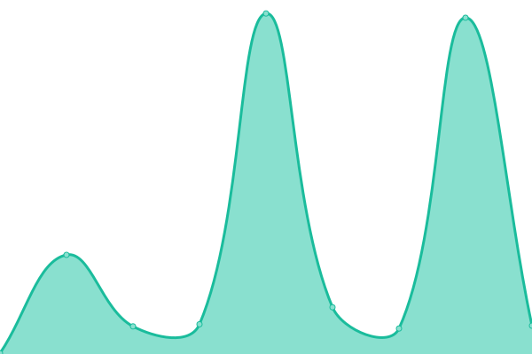
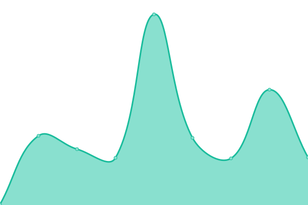

# [📈 Live Status](https://dotgov-dev.github.io): <!--live status--> **🟩 All systems operational**

This repository contains the open-source uptime monitor and status page for [Upptime](https://upptime.js.org), powered by [Upptime](https://github.com/upptime/upptime).

With [Upptime](https://upptime.js.org), you can get your own unlimited and free uptime monitor and status page, powered entirely by a GitHub repository. We use [Issues](https://github.com/upptime/upptime/issues) as incident reports, [Actions](https://github.com/DotGov-Dev/govuptime/actions) as uptime monitors, and [Pages](https://dotgov-dev.github.io) for the status page.

<!--start: status pages-->
<!-- This summary is generated by Upptime (https://github.com/upptime/upptime) -->
<!-- Do not edit this manually, your changes will be overwritten -->
<!-- prettier-ignore -->
| URL | Status | History | Response Time | Uptime |
| --- | ------ | ------- | ------------- | ------ |
|  [USPS - Tools](https://tools.usps.com) | 🟩 Up | [usps-tools.yml](https://github.com/DotGov-Dev/govuptime/commits/HEAD/history/usps-tools.yml) | 

 329ms
     
 | 

<a href="https://DotGov-Dev.github.io/govuptime/history/usps-tools">100.00%</a>
    

|  [NIH - NCBI](https://ncbi.nlm.nih.gov) | 🟩 Up | [nih-ncbi.yml](https://github.com/DotGov-Dev/govuptime/commits/HEAD/history/nih-ncbi.yml) | 

 264ms
     
 | 

<a href="https://DotGov-Dev.github.io/govuptime/history/nih-ncbi">100.00%</a>
    

|  [NIH - Pubmed](https://pubmed.ncbi.nlm.nih.gov/) | 🟩 Up | [nih-pubmed.yml](https://github.com/DotGov-Dev/govuptime/commits/HEAD/history/nih-pubmed.yml) | 

 164ms
     
 | 

<a href="https://DotGov-Dev.github.io/govuptime/history/nih-pubmed">100.00%</a>
    

|  [CDC - Homepage](https://www.cdc.gov/) | 🟩 Up | [cdc-homepage.yml](https://github.com/DotGov-Dev/govuptime/commits/HEAD/history/cdc-homepage.yml) | 

 1019ms
     
 | 

<a href="https://DotGov-Dev.github.io/govuptime/history/cdc-homepage">100.00%</a>
    

|  [USPS - Registration](https://reg.usps.com/) | 🟩 Up | [usps-registration.yml](https://github.com/DotGov-Dev/govuptime/commits/HEAD/history/usps-registration.yml) | 

 243ms
     
 | 

<a href="https://DotGov-Dev.github.io/govuptime/history/usps-registration">100.00%</a>
    

<!--end: status pages-->

[**Visit our status website →**](https://dotgov-dev.github.io)

## 📄 License

- Powered by: [Upptime](https://github.com/upptime/upptime)
- Code: [MIT](./LICENSE) © [Upptime](https://upptime.js.org)
- Data in the `./history` directory: [Open Database License](https://opendatacommons.org/licenses/odbl/1-0/)
